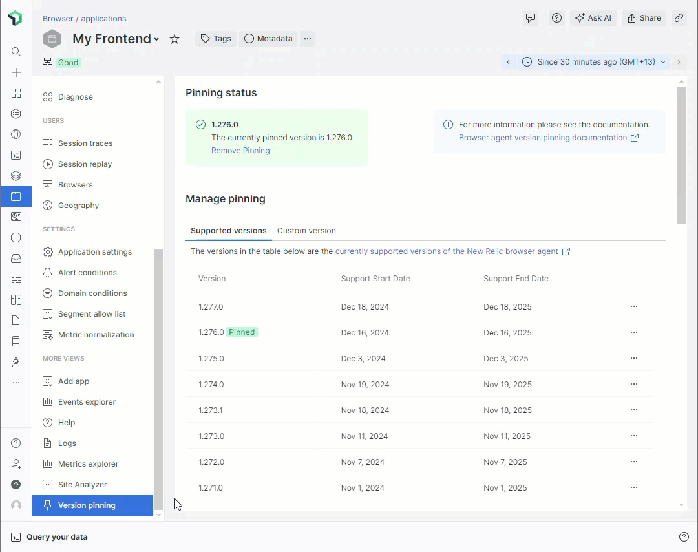

# Browser Agent Version Pinning (nr1-browser-agent-version-pinning)

[](https://github.com/chris-pilcher/nr1-browser-agent-version-pinning/actions/workflows/test.yml) 
[](https://github.com/chris-pilcher/nr1-browser-agent-version-pinning/releases)
[](https://github.com/chris-pilcher/nr1-browser-agent-version-pinning/blob/main/LICENSE)

> Pin your browser agent version directly from the New Relic UI.

## Features

- 📌 Pin browser agent versions with a single click
- 🔓 Unpin the browser agent version
- 👀 View current pinning status of your browser application

## Demo



## Installation

1. Log in to [New Relic One](https://one.newrelic.com)
2. Click "Integrations & Agents" in the sidebar
3. Click "apps & visualizations" link at the top of the page
4. Search for "Browser Agent Version Pinning"
5. Click "Browser Agent Version Pinning"
6. Click "Add this app"
7. Navigate to your browser application
8. Click "Version pinning" in the sidebar

## Local Development

### Prerequisites

- [Node.js](https://nodejs.org/en/)
- [npm](https://www.npmjs.com/)
- [New Relic One CLI](https://developer.newrelic.com/build-tools/new-relic-one-applications/cli)

### Commands

```shell
cd src
npm install
npm start
```

### Viewing in New Relic

- Visit https://one.newrelic.com/?nerdpacks=local
- Navigate to your browser application
- Click "Version pinning" in the sidebar

## Publishing

Publishing is done via GitHub Actions. The following steps are required:

- Create a new release in [GitHub](https://github.com/chris-pilcher/nr1-browser-agent-version-pinning/releases)
  - **Tag**: Tag version should be in the format `v1.2.3`
  - **Title**: Release title should be `X.Y.Z (Month Day, Year)`. E.g. `1.2.3 (June 1, 2021)`
  - **Description**: Release description should be a summary of changes.
- Publish the release will trigger the [publish workflow](https://github.com/chris-pilcher/nr1-browser-agent-version-pinning/actions/workflows/publish.yml) in GitHub Actions
  - Publish will set the NPM version based on the GitHub release tag from the previous step
  - Publish the Nerdpack to New Relic One
- *Note: You must be a collaborator on the repository to publish*

